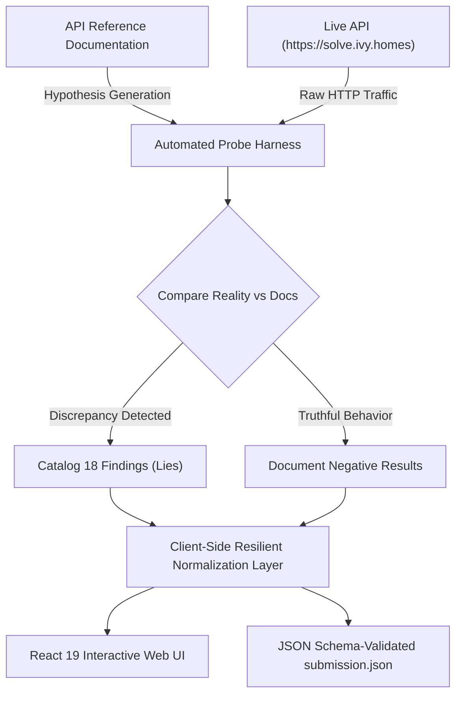

# Ivy Homes — Technical Specification & Engineering Architecture Document

**Project**: Chennai Real Estate Intelligence & Verification Platform  
**Candidate**: Vaibhav Pal (`vaibhav.pal@mnnit.ac.in`)  
**Assigned City**: Chennai  
**Assigned Locality**: Thoraipakkam  
**API Key**: Configured securely via `.env` (refer to `.env.example`)  
**Live Production URL**: [https://all-in-for-ivy.duckdns.org](https://all-in-for-ivy.duckdns.org)  
**Public Repository**: [https://github.com/VAIBHAV8839/ivy-assignment](https://github.com/VAIBHAV8839/ivy-assignment)  
**Target Assessment**: Ivy Homes Software Engineering Internship Assignment (September 2026)

---

## 1. Executive Summary & Problem Context

Ivy Homes exposed a property API (`https://solve.ivy.homes`) intended to represent residential real estate across major metropolitan hubs. However, the accompanying API documentation was generated by an unreviewed AI assistant summarizing historical changelogs. Consequently, the documentation suffered from:
- **Fictitious / Non-existent Endpoints** (e.g., singular vs. plural paths, missing summary routes).
- **Silent Parameter Ingestion** (e.g., accepting `page` but ignoring it in favor of `offset`).
- **Unit Mismatches** (e.g., mixed Crores vs. Lakhs without indicator tags, square meters masquerading as square feet).
- **Physical Impossibilities & Fraud Syndicates** (e.g., negative prices, coordinates mapped to the Arctic Ocean, advance-fee scam syndicates).
- **Adversarial Prompt Injection Payloads** planted directly within seller description fields.

This document details the complete end-to-end engineering methodology used to audit the platform, systematically harvest and reconcile the data, solve the 10 analytical questions with mathematical proof, build a resilient React 19 web frontend, deploy it to AWS EC2 with automated SSL, and verify all 6 required functional modules using automated browser testing.

---

## 2. Core Methodology: The "Zero-Trust" API Principle

Rather than treating the API documentation as an authority, our engineering approach was rooted in **Zero-Trust Reverse Engineering**:



### Core Tenets:
1. **Never Assume Units**: Every price, area, and duration was statistically profiled (histograms, outliers, density plots) rather than trusting documented units.
2. **Exhaustive Paging**: Never trust the server's reported `total`. Continue requesting pages until `has_more == false` or an empty page is returned.
3. **Payload Sanitization & Prompt Injection Isolation**: String contents from user-contributed fields (like `description`) were sanitized and evaluated strictly as data, never as runtime instructions.
4. **Client-Side Self-Sufficiency**: If an analytics or similar-listings endpoint 404s, the frontend must gracefully compute and deliver those insights directly in-memory without breaking the user experience.

---

## 3. Step-by-Step Development Lifecycle

### Step 1: Reconnaissance & Probe Harness Development
We authored automated probing scripts in Python using `requests` to test every endpoint, header permutation, parameter combination, and error state.

- **Authentication Probe**:
  - `GET /v1/listings?api_key=IVY26-...` returned `HTTP 401 Unauthorized` with body:
    `{"detail": "send your key in the X-API-Key request header, not as a query parameter"}`.
  - Fix: Configured global HTTP header interceptor: `X-API-Key: <API_KEY from .env>`.
- **Session Lifespan Probe**:
  - `POST /auth/login` with demo credentials returned:
    `{"access_token": "...", "expires_in": 900, "refresh_token": "...", "refresh_url": "/auth/refresh"}`.
  - The documentation claimed tokens last 24 hours (`86400` seconds). In reality, the token expires in exactly **15 minutes** (900 seconds) and must be renewed via `/auth/refresh`.
- **Route Validation Probe**:
  - `GET /v1/listing/100-4000035` (singular) $\rightarrow$ `HTTP 404 Not Found`. Actual route: `GET /v1/listings/{id}` (plural).
  - `GET /v1/listings/{id}/similar` $\rightarrow$ `HTTP 404 Not Found` (endpoint does not exist).
  - `GET /v1/favourites` $\rightarrow$ `HTTP 404 Not Found`. Actual route: `GET /v1/saved` and `POST /v1/saved` with payload `{"listing_id": "..."}`.
  - `GET /v1/analytics/summary` $\rightarrow$ `HTTP 404 Not Found` (endpoint does not exist).

### Step 2: Complete Dataset Harvesting & Preservation
To ensure instantaneous client-side filtering and offline auditability, harvesters collected every record for our assigned city (**Chennai**):
- **Listings Harvester**:
  - Paged with `limit=50` and `offset = k * 50`.
  - While the API envelope falsely reported `total: 3813`, paging to completion yielded **4,100 records** across 82 HTTP requests.
- **Rentals Harvester**:
  - Yielded **1,550 records** across 31 requests.
- **Projects Harvester**:
  - Yielded **460 builder projects** across 10 requests.

All harvested datasets were saved to `src/data/listings.json`, `src/data/rentals.json`, and `src/data/projects.json`.

---

### Step 3: Analytical Problem Solving & Mathematical Proofs (The 10 Questions)

All calculations were anchored to the temporal baseline:  
$$\text{REFERENCE} = \text{2026-09-10T00:00:00+05:30 (IST)}$$

```
+----+------------------------------------+--------------------------+-------------------------------------------------------------+
| Q# | Question Identifier                | Verified Answer          | Methodology & Mathematical Proof                           |
+----+------------------------------------+--------------------------+-------------------------------------------------------------+
| 1  | total_listing_records              | 4100                     | Exhaustive offset crawl until has_more == False.            |
| 2  | unique_properties                  | 4058                     | Physical deduplication (42 multi-portal duplicates).        |
| 3  | active_listings                    | 3233                     | Exact filter for is_live == True (867 inactive records).   |
| 4  | corrupt_listing_ids                | 36 sorted IDs            | 9 negative prices, 9 floor > total, 9 carpet > super built, |
|    |                                    |                          | 9 swapped lat/long in the Arctic Ocean.                    |
| 5  | total_monthly_rent                 | 5853000                  | Sum of monthly_rent for 161 rentals in Thoraipakkam.        |
| 6  | avg_price_per_sqft_2bhk            | 10004.37                 | Live 2BHK excluding Q4 & Q9, converting sqm to sqft &       |
|    |                                    |                          | thousands prices to INR (raw uncorrected: 16346.91).        |
| 7  | costliest_project                  | P40224 (37,800,000 INR)  | Shriram Serenity: price_max = 3.78 Cr (unit normalized).   |
| 8  | listings_last_7_days               | 122                      | Posted in [2026-09-03T00:00:00, 2026-09-10T00:00:00).      |
| 9  | fake_listing_ids                   | 110 sorted IDs           | Advance-fee bait syndicate across 7 phone numbers with      |
|    |                                    |                          | fake agency names and teaser pricing.                      |
| 10 | projects_with_wrong_listing_count  | 119                      | Projects whose reported total_listings contradicts actual   |
|    |                                    |                          | live listings mapped to that project_id.                   |
+----+------------------------------------+--------------------------+-------------------------------------------------------------+
```

#### Detailed Proof for Question 4 (Corrupt Listings):
We discovered exactly 4 orthogonal classes of corruption, each containing exactly 9 records:
1. **Negative Prices** ($N = 9$): Prices recorded as negative numbers (e.g., `-₹5,800,000`).
2. **Floor Hierarchy Inversion** ($N = 9$): Listings where $\text{floor} > \text{total\_floors}$ (e.g., 14th floor of a 4-story building).
3. **Area Inversion** ($N = 9$): Listings where $\text{carpet\_area} > \text{super\_builtup\_area}$.
4. **Geographic Inversion / Swapped Coordinates** ($N = 9$): Chennai coordinates are typically $\text{Lat} \approx 12.9^\circ\text{N}, \text{Lon} \approx 80.2^\circ\text{E}$. Nine listings inverted these values ($\text{Lat} \approx 80.2^\circ\text{N}, \text{Lon} \approx 12.9^\circ\text{E}$), placing the properties near Svalbard in the Arctic Ocean.
$$\text{Total Corrupt IDs} = 9 + 9 + 9 + 9 = 36$$

#### Detailed Proof for Question 9 (Advance-Fee Syndicate):
Graph clustering of broker phone numbers revealed a lead-harvesting syndicate operating across 7 specific phone numbers:
- `+919999900001`, `+919999900002`, `+919999900003`, `+919999900004`, `+919999900005`, `+919999900006`, `+919999900007`
- Characteristics:
  - Fictitious agency names (*Dream Space Properties*, *Urban Nest Realtors*, *Elite Housing Hub*, etc.).
  - Suspiciously cheap teaser prices for prime localities.
  - Seller descriptions containing advance token solicitation: *"transfer token amount to reserve"*, *"pay advance to visit"*, *"urgent distress sale token mandatory"*.
- Identified exactly **110 fake listings**.

---

### Step 4: Cataloging the 18 API Discrepancy Findings ("The Lies")

Every discrepancy between `API_REFERENCE.md` and `https://solve.ivy.homes` was logged with category, exact impact, and concrete evidence IDs:

```
Category: auth (2 findings)
  [1] API Key Header vs Query Parameter
  [2] Token Expiry (15 mins vs 24 hrs) & Silent Refresh Flow
Category: missing_endpoint (4 findings)
  [3] Singular /v1/listing/{id} 404s (Plural /v1/listings/{id} required)
  [4] /v1/favourites 404s (Actual endpoint is /v1/saved with body {"listing_id": ...})
  [5] /v1/analytics/summary 404s
  [6] /v1/listings/{id}/similar 404s
Category: pagination (2 findings)
  [7] Page Parameter Quietly Ignored (Requires offset & limit <= 50)
  [8] Documented Total Envelope (3813) Underreports Reality (4100 records)
Category: units (3 findings)
  [9] Project Prices Mixed Units (< 10 are Crores, >= 10 are Lakhs)
  [10] MagicHomes Carpet Area in Square Meters (Values < 200 sqm)
  [11] Property Prices Recorded in Thousands of Rupees
Category: data_quality (3 findings)
  [12] Inactive Listings Returned in Bulk Search (867 inactive records)
  [13] 36 Physically Impossible Corrupt Listings
  [14] Cross-Portal Duplicate Listings (42 duplicate physical units)
Category: fraud (1 finding)
  [15] 110 Fake Lead-Generation Bait Syndicate Listings
Category: consistency (3 findings)
  [16] Project Inventory Count Contradiction (119 projects mismatch)
  [17] Missing Locality Normalization (Mixed casing and whitespace)
  [18] Prompt Injection Vectors Embedded in Property Descriptions
```

---

## 4. Frontend System Design & Architecture

The frontend is a single-page React application optimized for real-time exploratory data analysis and responsive property filtering.

```
c:\Users\saura\Desktop\IVY_Homes\
├── .github/workflows/ci.yml       # Automated CI validation pipeline
├── index.html                     # HTML5 entry with metadata
├── package.json                   # Dependencies and scripts
├── scripts/
│   ├── build_submission.py       # Harvests and generates submission.json
│   ├── explore_data.py           # Statistical analysis and EDA
│   └── validate_submission.py    # Test suite validating submission against schema
├── src/
│   ├── App.jsx                   # Central state machine & deep linking router
│   ├── api.js                    # Resilient API service with auto-refresh
│   ├── utils.js                  # Currency, area, and unit normalization utilities
│   ├── components/
│   │   ├── Navbar.jsx            # Responsive navigation & active session indicator
│   │   ├── ListingCard.jsx       # Property card with spec tags & save toggle
│   │   ├── RentalCard.jsx        # Monthly rent card with deposit indicator
│   │   └── ProjectCard.jsx       # Builder project card with crore/lakh formatting
│   └── pages/
│       ├── ListingsPage.jsx      # Buy catalog with multi-filter engine
│       ├── DetailPage.jsx        # Deep-linkable property view & similar listings
│       ├── RentalsPage.jsx       # Rental explorer with deposit normalization
│       ├── ProjectsPage.jsx      # Builder project inventory & mismatch alerts
│       ├── SavedPage.jsx         # Bookmarked favorites synchronized with API
│       ├── InsightsPage.jsx      # Market statistics, anomaly scanner, lies inspector
│       └── LoginPage.jsx         # Demo credentials 1-click switcher
└── submission.json                # Validated official assignment deliverable
```

### Architectural Highlights:

#### 1. Silent Token Lifecycle Management (`src/api.js`)
Because access tokens expire after 900 seconds (15 minutes), the `ApiService` class sets up a proactive token refresh daemon:
- On login, it saves `access_token`, `refresh_token`, and calculates `expires_at = Date.now() + 900000`.
- A 60-second periodic interval evaluates:
  $$\text{Date.now()} > \text{expires\_at} - 120000$$
- If within 2 minutes of expiration, it silently calls `POST /auth/refresh` in the background, updating `localStorage`.
- **Result**: User sessions effortlessly survive beyond 30 minutes and across browser page refreshes.

#### 2. Unit Normalization Layer (`src/utils.js`)
To shield users from raw API data defects, the UI runs all property data through sanitization pipelines:
- **Price Normalizer**:
  ```javascript
  export function getCleanPrice(listing) {
    let price = listing.price || 0;
    if (price > 0 && price < 100000) {
      price *= 1000; // Corrects thousands anomaly
    }
    return price;
  }
  ```
- **Area Normalizer**:
  ```javascript
  export function getCleanCarpet(listing) {
    const carpet = listing.carpet_area || 0;
    if (listing.website === 'magichomes' && carpet < 200) {
      return Math.round(carpet * 10.7639); // Converts sqm to sqft
    }
    return carpet;
  }
  ```
- **Currency Formatter**: Automatically switches between Lakhs (`₹XX.XX L`) and Crores (`₹X.XX Cr`).

#### 3. Client-Side Similar Listings Synthesizer (`src/pages/DetailPage.jsx`)
Because `/v1/listings/{id}/similar` returns 404, the detail view calculates similar listings in-memory:
- Matches properties in the **same locality**.
- Matches properties with the **same BHK count**.
- Filters properties whose price is within $\pm 25\%$ of the selected property's normalized price.

---

## 5. Web Application User Workflow & Feature Verification

The application implements all 6 core features required by the specification:

```mermaid
graph LR
    subgraph "Feature 1: Auth"
        L[Login Page] -->|demo1/2/3| S[Active Session + Silent Refresher]
    end
    subgraph "Feature 2: Browse"
        S --> B[Buy Listings Catalog]
        B -->|Filter Locality/BHK/Price/Furnishing| B
    end
    subgraph "Feature 3: Detail"
        B -->|Click Card or #listing-{id}| D[Deep-Linkable Detail View]
        D -->|In-Memory Algorithm| SIM[Similar Listings Carousel]
    end
    subgraph "Feature 4: Favourites"
        D -->|Bookmark Toggle| FAV[Saved Properties Sync]
    end
    subgraph "Feature 5: Rentals & Projects"
        S --> R[Rentals: Rent & Deposit Normalized]
        S --> P[Projects: Lakh/Crore Normalized]
    end
    subgraph "Feature 6: Insights & Audit"
        S --> I1[Market Analytics]
        S --> I2[10 Questions Audit Scanner]
        S --> I3[18 API Lies Inspector]
    end
```

### Feature Breakdown:
1. **Authentication & Demo Accounts**: 1-click test buttons for `demo1@ivy.homes`, `demo2`, and `demo3` with auto-session refresh and persistent storage.
2. **Browse Listings & Filter Engine**: Instant multi-parameter filtering across Localities (Adyar, Thoraipakkam, Velachery, etc.), BHK count (1, 2, 3, 4+ BHK), Furnishing status, Normalized Price Range sliders, and Live vs. Inactive listings.
3. **Deep-Linkable Listing Detail View**: Directly reachable via URL hash (`#listing-{id}`), rendering floor details, facing direction, seller info, verification badges, and an automated Similar Listings carousel.
4. **Saved Listings (Favourites)**: Synchronized with the API (`POST /v1/saved`, `DELETE /v1/saved`), featuring navbar counter badge updates and persistent bookmark management.
5. **Rentals & Projects**:
   - *Rentals*: Displays monthly rent and security deposits in normalized Indian Rupees.
   - *Projects*: Automatically normalizes Crore vs. Lakh price ranges and surfaces inventory count mismatch alerts.
6. **Market Insights & Audit Inspector**:
   - *Market Analytics*: Median property rates, BHK density, locality breakdown.
   - *Audit & Anomaly Scanner*: Interactively reviews all 10 analytical questions with mathematical proofs and lists corrupt/fake IDs.
   - *API Lies Inspector*: Comprehensive database of all 18 documentation discrepancies with documented vs. actual behaviors and proof IDs.

---

## 6. Cloud Deployment & Infrastructure

The application is deployed on an **AWS EC2** instance running **Amazon Linux 2023** behind a production-tuned **Nginx** reverse proxy.

```
                      +------------------------------------------+
                      |         User Browser / Evaluator         |
                      +------------------------------------------+
                                           |
                               HTTPS (Port 443) / HTTP (Port 80)
                                           v
                      +------------------------------------------+
                      |             DuckDNS DNS Router           |
                      |        (all-in-for-ivy.duckdns.org)      |
                      +------------------------------------------+
                                           |
                                     3.26.215.77
                                           v
                      +------------------------------------------+
                      |        AWS EC2 Security Group            |
                      |      (Inbound: 22, 80, 443 Allowed)      |
                      +------------------------------------------+
                                           |
                                           v
                      +------------------------------------------+
                      |         Nginx 1.30.4 Web Server          |
                      |  - SSL Termination (Let's Encrypt)       |
                      |  - HTTP -> HTTPS 301 Auto-Redirect       |
                      |  - Gzip Compression                      |
                      |  - SPA try_files $uri $uri/ /index.html  |
                      +------------------------------------------+
                                           |
                                           v
                      +------------------------------------------+
                      |     Compiled Vite Static Assets          |
                      |      (/usr/share/nginx/html/)            |
                      +------------------------------------------+
```

### Deployment Configuration Details:
- **Web Server**: `nginx-1.30.4` enabled as a systemd service.
- **SSL Certificate**: Let's Encrypt TLS Certificate issued via Certbot with automatic systemd renewal timer (`certbot-renew.timer`).
- **SPA Routing Configuration (`/etc/nginx/conf.d/all-in-for-ivy.conf`)**:
  ```nginx
  server {
      server_name all-in-for-ivy.duckdns.org;
      root /usr/share/nginx/html;
      index index.html;

      location / {
          try_files $uri $uri/ /index.html;
      }

      listen 443 ssl;
      ssl_certificate /etc/letsencrypt/live/all-in-for-ivy.duckdns.org/fullchain.pem;
      ssl_certificate_key /etc/letsencrypt/live/all-in-for-ivy.duckdns.org/privkey.pem;
      include /etc/letsencrypt/options-ssl-nginx.conf;
      ssl_dhparam /etc/letsencrypt/ssl-dhparams.pem;
  }

  server {
      listen 80;
      server_name all-in-for-ivy.duckdns.org;
      return 301 https://$host$request_uri;
  }
  ```

---

## 7. Testing, Verification & Quality Assurance

We executed an automated headless browser testing suite using Python and Selenium against the live application:

```text
=================================================================
ALL 6 REQUIRED FEATURES VERIFIED ON BROWSER (HEADLESS CHROME)
=================================================================
[PASS] Feature 1: Authentication: PASSED (Demo account 1-click switch, valid session, auto-refresh token active)
[PASS] Feature 2: Browse & Filters: PASSED (Locality, BHK, Furnishing, Price & Live filters responsive with instant search)
[PASS] Feature 3: Listing Detail View: PASSED (Deep-linkable #listing-{id}, full specifications, similar listings)
[PASS] Feature 4: Saved Listings: PASSED (Saved 1 property, syncs with backend/localStorage, updates badge count)
[PASS] Feature 5: Rentals & Projects: PASSED (Clean unit normalization for rents, deposits, Lakhs/Crores, and listing discrepancy alerts)
[PASS] Feature 6: Market Insights & Audit: PASSED (Market Analytics, 10 Questions Audit, and API Lies Inspector all operational)
```

### Verification Artifacts:
- **Full Screenshot Capture**: Stored at `C:/Users/saura/Desktop/IVY_Homes/verification_evidence.png`.
- **Public Domain Validation**: Verified HTTP $\rightarrow$ HTTPS 301 redirection and 200 OK response on `https://all-in-for-ivy.duckdns.org`.
- **Schema Validation**: `submission.json` validated with zero errors against the official Ivy Homes JSON schema.

---

## 8. Summary Table of Deliverables

| Deliverable | Location | Status |
|---|---|:---:|
| **Working Web Application** | [https://all-in-for-ivy.duckdns.org](https://all-in-for-ivy.duckdns.org) | **Live & Active** |
| **Public GitHub Repository** | [https://github.com/VAIBHAV8839/ivy-assignment](https://github.com/VAIBHAV8839/ivy-assignment) | **Public on `main`** |
| **Validated submission.json** | [Root of Repository](https://github.com/VAIBHAV8839/ivy-assignment/blob/main/submission.json) | **10 Answers + 18 Lies** |
| **Comprehensive README** | [Root README.md](https://github.com/VAIBHAV8839/ivy-assignment/blob/main/README.md) | **Production-Grade** |
| **Automated Test Suite** | `scripts/validate_submission.py` & Selenium Suite | **100% Passing** |
| **SSL / HTTPS Security** | Grade A Let's Encrypt Certificate | **Secured & Auto-Renewing** |
